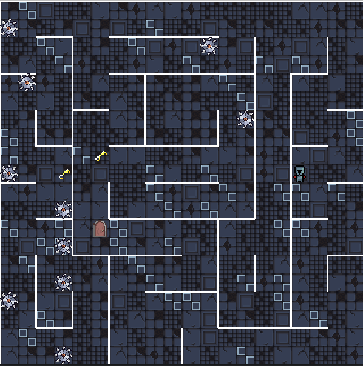
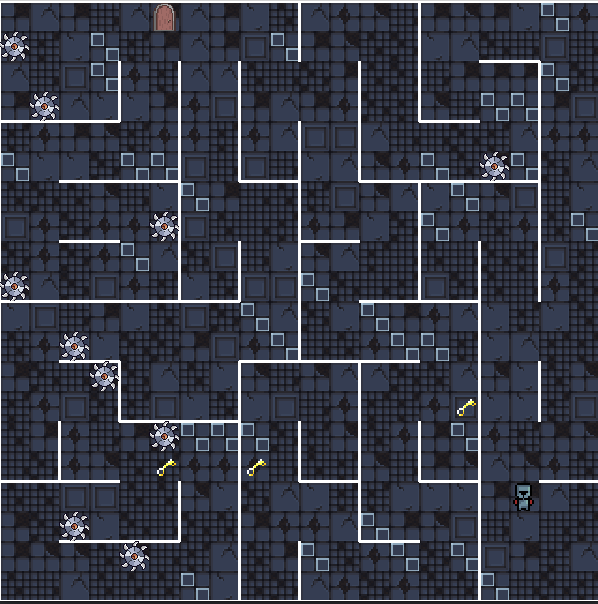
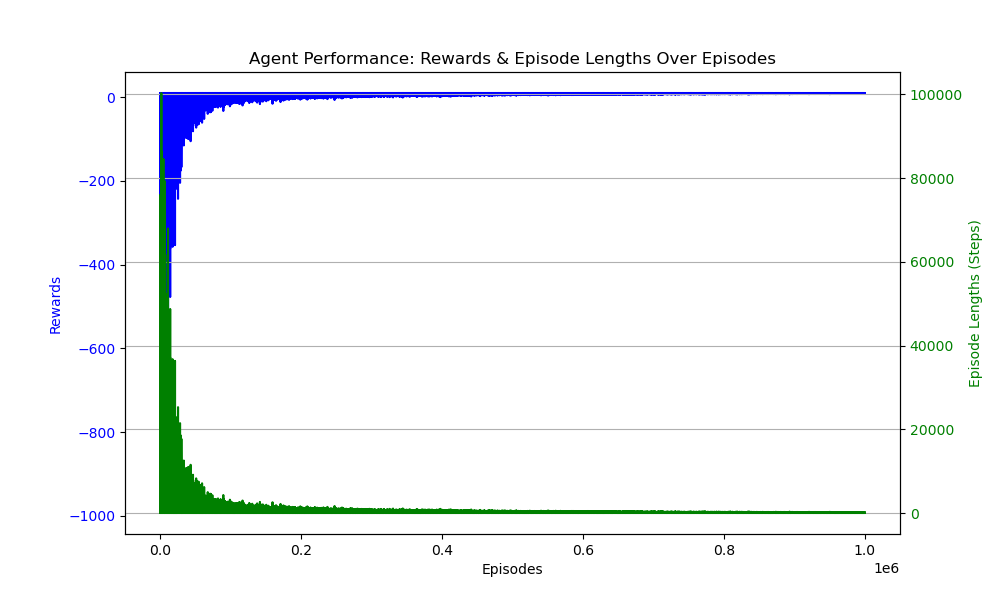

# RL-Labyrinth

## Description

This project consists of a custom maze environment made using the base **gym** environment and ran
using a coupled **GUI** made using **pygame**. The purpose is to train and test **reinforcement learning agents** on this environment. 


## Features

### Procedurally generated maze environment
The maze is generated procedurally and the location of the objectives and agent are also randomized.

<div style="display: flex; justify-content: space-between;">
  
  
</div>

### Tools to build on
The environment can be derived in order to be further customized. This feature is useful
to test custom observation spaces of the environment.

### Agent creation and training
The project contains APIs that makes agent creation and training easy, as the environment is **gym** based.
Implementations of such agents are [SARSA](https://en.wikipedia.org/wiki/State%E2%80%93action%E2%80%93reward%E2%80%93state%E2%80%93action)
and [Q-Learning](https://en.wikipedia.org/wiki/Q-learning). The performance was measured for each agent,
an example of **SARSA** would be in the following image:



## Usage

1. Clone the repo
2. Create Environment via Conda
```bash
    conda env create -f environment.yml
    conda activate RL-Labyrinth
```

